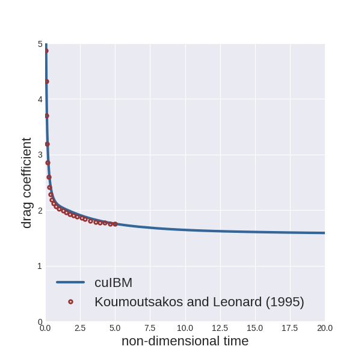
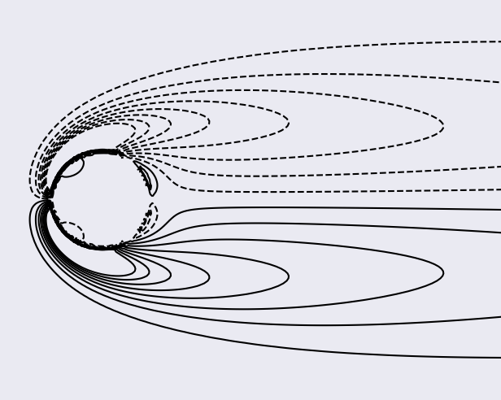
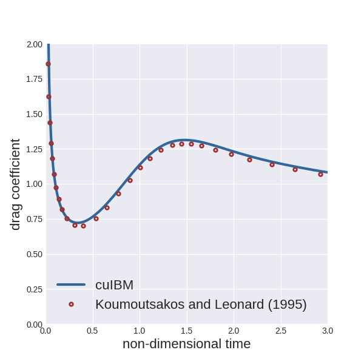
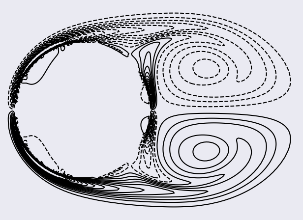
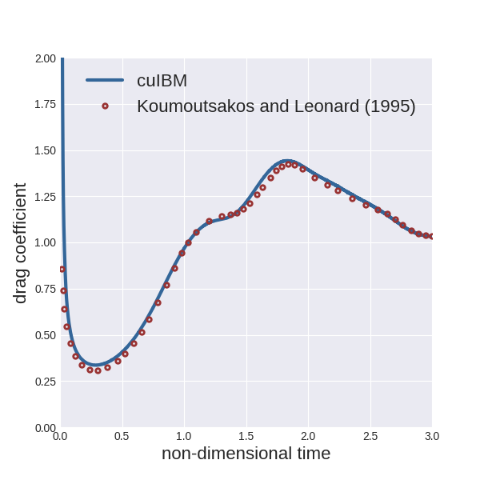
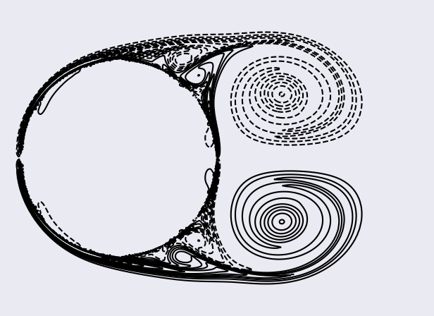

## Flow around impulsively-started cylinder

We solve the Navier-Stokes equations, using the immersed-boundary projection method proposed by Taira and Colonius (2007), for the flow around an impulsively-started cylinder at Reynolds numbers `40`, `550`, and `3000`.
(The Reynolds number is based on the kinematic viscosity of the fluid, the diameter of the cylinder, and the freestream speed.)

For all cases, the drag coefficient is compared with computational results from Koumoutsakos and Leonard (1995).

The domain consists in a `30Dx30D` square (where `D` is the diameter of the cylinder), with the bluff body centered in it.
The grid is uniform in the vicinity of the cylinder and stretched to the external boundaries with a constant ratio.
The grid spacing in the uniform region is reduced as we increase the Reynolds number.

The cylinder is uniformly discretized with the distance between two consecutive points matching the grid spacing of the background mesh.

The convective terms and diffusive terms are integrated in time using a second-order Adams-Bashforth scheme and a second-order Crank-Nicolson technique, respectively.

We impose a Dirichlet condition for the velocity, `(1, 0)`, at left, bottom, and top boundaries.
We use a convective condition at the right boundary (advection speed set to be the freestream one).
The fluid velocity is initially set to `(1, 0)` everywhere in the domain.

The velocity system is solved using a bi-conjugate-gradient stabilized technique, with a diagonal preconditioner, and with an exit criterion set with an absolute tolerance of `1.0E-6`.
For the Poisson system, we employ a conjugate-gradient method preconditioned by a algebraic multigrid technique with smoothed aggregation, and an exit criterion set with an absolute tolerance of `1.0E-6`.

### Re = 40

The grid (`330x330` cells) is uniform in the vicinity of the cylinder (`[-0.54, 0.54]x[-0.54, 0.54]`) with spacing `0.02` and stretched to the external boundaries with a constant ratio of `1.02`.
Using an NVIDIA K40c device, we computed `2000` time steps (time-step size `0.01`) in about 3 minutes.

To run the example:

    > cd $CUIBM_DIR/examples/cylinder/Re40
    > cuibm

To plot the instantaneous drag coefficient up to 20 non-dimensional time units:

    > python scripts/plotDragCoefficient.py

To plot the contours of the vorticity field (between `-3` and `3` with `16` steps) at saved time steps in the sub-region `[-1, 4]x[-2, 2]`:

    > python scripts/plotVorticity.py

The figures should be saved in the folder `images`; here are the figures we obtained:

### Re = 550

The grid (`450x450` cells) is uniform in the vicinity of the cylinder (`[-0.54, 0.54]x[-0.54, 0.54]`) with spacing `0.01` and stretched to the external boundaries with a constant ratio of `1.02`.
Using an NVIDIA K40c device, we computed `1200` time steps (time-step size `0.0025`) in less than 4 minutes.

To run the example:

    > cd $CUIBM_DIR/examples/cylinder/Re550
    > cuibm

To plot the instantaneous drag coefficient up to 3 non-dimensional time units:

    > python scripts/plotDragCoefficient.py

To plot the contours of the vorticity field (between `-32` and `32` with `32` steps) at saved time steps in the sub-region `[-0.6, 1.6]x[-0.8, 0.8]`:

    > python scripts/plotVorticity.py

The figures should be saved in the folder `images`; here are the figures we obtained:

### Re = 3000

The grid (`986x986` cells) is uniform in the vicinity of the cylinder (`[-0.52, 0.52]x[-0.52, 0.52]`) with spacing `0.004` and stretched to the external boundaries with a constant ratio of `1.01`.
Using an NVIDIA K40c device, we computed `3000` time steps (time-step size `0.001`) in about 25 minutes.
The run requires about 1.1GB of memory on device.

To run the example:

    > cd $CUIBM_DIR/examples/cylinder/Re3000
    > cuibm

To plot the instantaneous drag coefficient up to 3 non-dimensional time units:

    > python scripts/plotDragCoefficient.py

To plot the contours of the vorticity field (between `-56` and `56` with `28` steps) at saved time steps in the sub-region `[-0.6, 1.6]x[-0.8, 0.8]`:

    > python scripts/plotVorticity.py

The figures should be saved in the folder `images`; here are the figures we obtained:

### References

* Koumoutsakos, P., & Leonard, A. (1995). High-resolution simulations of the flow around an impulsively started cylinder using vortex methods. Journal of Fluid Mechanics, 296, 1-38.

* Taira, K., & Colonius, T. (2007). The immersed boundary method: a projection approach. Journal of Computational Physics, 225(2), 2118-2137.