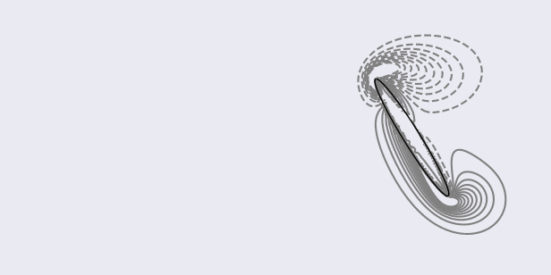

## Flapping wing

We solve the Navier-Stokes equations with the immersed-boundary projection method proposed by Taira and Colonius (2007) for the flow generated by a flapping wing at Reynolds number 75.
(The Reynolds number is based on the maximum translational velocity, the chord of the wing, and the kinematic viscosity of the fluid.)

The wing is modeled with an ellipse with a chord length of 1 and and a thickness-to-chord ratio of 0.12.
The kinematics of the wing is imposed:

`x(t) = A0/2 cos(2πft)`

`α(t) = α0 + β sin(2πft + ϕ)`

where `x(t)` is the position of the center of the foil and `α(t)` is the angle made by the foil with the line of oscillation.
`A0=2.8c` is the amplitude of translation (with `c` the chord length of the wing); `β=π/4` is the amplitude of rotation; `α0=π/2` is offset rotation; `f=0.25` is the frequency.
Here, we choose a symmetrical rotation (`ϕ=0`).

The wing is initially centered in a `30cx30c` domain.
The grid (`930x654` cells) is uniformly discretized in the sub-region `[-2, 2]x[-0.52, 0.52]` with spacing `0.01` and stretched to the external boundaries with constant ratio `1.01`.

The ellipse is uniformly discretized with the distance between two consecutive points matching the grid spacing of the background mesh.

The convective terms and diffusive terms are integrated in time using a second-order Adams-Bashforth scheme and a second-order Crank-Nicolson technique, respectively.

We use a no-slip condition for the velocity at all boundaries and the fluid is initially at rest.

The velocity system is solved using a bi-conjugate-gradient stabilized technique, with a diagonal preconditioner, and with an exit criterion set with a relative tolerance of `1.0E-5`.
For the Poisson system, we employ a conjugate-gradient method preconditioned by a algebraic multigrid technique with smoothed aggregation, and an exit criterion set with a relative tolerance of `1.0E-5`.

Using an NVIDIA K20c device, we computed `16000` time steps (time-step size `0.001`) in about 10 hours.
The run requires about 0.7GB of memory on device.

To run the example:

    > cd $CUIBM_DIR/examples/flapping/Re75
    > cuibm

We compare the instantaneous lift and drag coefficients over 4 periods of flapping, with the experimental and computational results from Wang et al. (2004), the computational results from Eldredge (2007), and the computational results from Li et al. (2015).

To plot the force coefficients:

    > python scripts/plotForceCoefficients.py

To plot the contours (between `-20` and `20` with `20` steps) of the vorticity field in the sub-region `[-2, 2]x[-1, 1]`:

    > python scripts/plotVorticity.py

All figures should be saved in the folder `images` of the simulation directory.

### References

* Eldredge, J. D. (2007). Numerical simulation of the fluid dynamics of 2D rigid body motion with the vortex particle method. Journal of Computational Physics, 221(2), 626-648.
* Li, C., Dong, H., & Liu, G. (2015). Effects of a dynamic trailing-edge flap on the aerodynamic performance and flow structures in hovering flight. Journal of Fluids and Structures, 58, 49-65.
* Taira, K., & Colonius, T. (2007). The immersed boundary method: a projection approach. Journal of Computational Physics, 225(2), 2118-2137.
* Wang, Z. J., Birch, J. M., & Dickinson, M. H. (2004). Unsteady forces and flows in low Reynolds number hovering flight: two-dimensional computations vs robotic wing experiments. Journal of Experimental Biology, 207(3), 449-460.