## Lid-driven cavity flow

We solve the Navier-Stokes equations (with no immersed boundary) in a square domain of unit length (`[0, 1] x [0, 1]`) for Reynolds numbers `100`, `1000`, `3200`, and `5000`.
(The Reynolds number is based on the kinematic viscosity of the fluid, the length of the cavity, and the speed of the lid.)

For all cases, the numerical solution is advanced in time until a steady state is reached and we compare the velocities at mid-cavity with the results from Ghia et al. (1982).

The computational domain is uniformly discretized with the same grid spacing in each direction.

The convective terms and diffusive terms are integrated in time using a second-order Adams-Bashforth scheme and a second-order Crank-Nicolson technique, respectively.

We use a Dirichlet condition for the velocity at all boundaries: a no-slip condition at left, right, and bottom boundaries; a constant velocity `(1, 0)` at top boundary.
The fluid is initially at rest and the lid is impulsively translated.

The velocity system is solved using a bi-conjugate-gradient stabilized technique, with a diagonal preconditioner, and with an exit criterion set with a relative tolerance of `1.0E-5`.
For the Poisson system, we employ a conjugate-gradient method preconditioned by a algebraic multigrid technique with smoothed aggregation, and an exit criterion set with a relative tolerance of `1.0E-5`.

### Re = 100

Using an NVIDIA K40c device, we computed `1000` time steps (time-step size `0.01`) on a `32x32` grid in less than 6 seconds.

To run the example:

    > cd $CUIBM_DIR/examples/lidDrivenCavity/Re100
    > cuibm

To plot the velocity components at mid-cavity and compare with results from Ghia et al. (1982):

    > python scripts/plotCenterlineVelocities.py

The figures should be saved in the folder `images`; here are the figures we obtained:

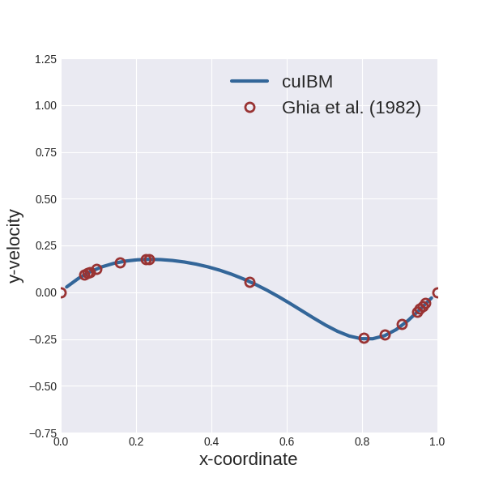

To plot the filled contour of the vorticity field:

    > python scripts/plotVorticity.py

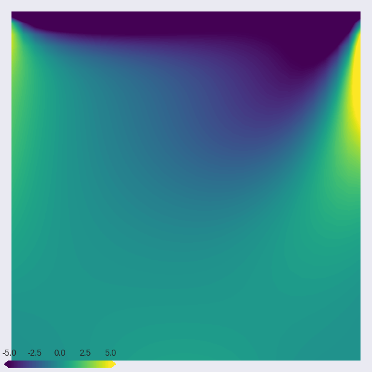

### Re = 1000

Using an NVIDIA K40c device, we computed `10000` time steps (time-step size `0.004`) on a `128x128` grid in about 80 seconds.

To run the example:

    > cd $CUIBM_DIR/examples/lidDrivenCavity/Re1000
    > cuibm

To plot the velocity components at mid-cavity and compare with results from Ghia et al. (1982):

    > python scripts/plotCenterlineVelocities.py

The figures should be saved in the folder `images`; here are the figures we obtained:

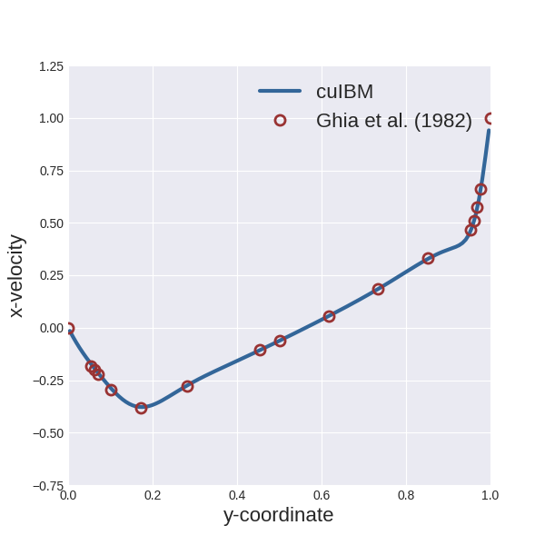

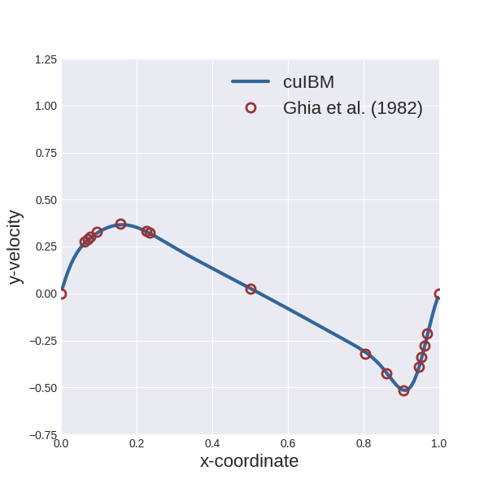

To plot the filled contour of the vorticity field:

    > python scripts/plotVorticity.py

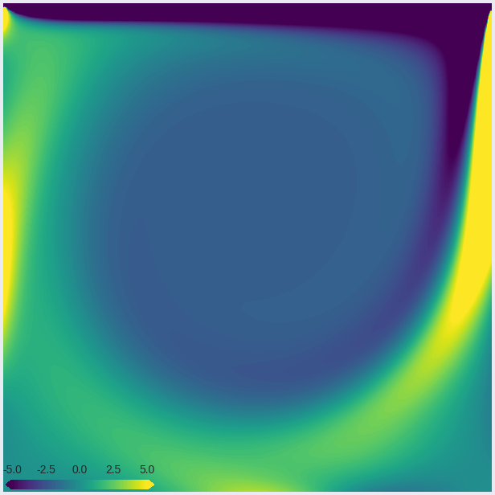

### Re = 3200

Using an NVIDIA K40c device, we computed `25000` time steps (time-step size `0.002`) on a `192x192` grid in about 4 minutes and 30 seconds.

To run the example:

    > cd $CUIBM_DIR/examples/lidDrivenCavity/Re3200
    > cuibm

To plot the velocity components at mid-cavity and compare with results from Ghia et al. (1982):

    > python scripts/plotCenterlineVelocities.py

The figures should be saved in the folder `images`; here are the figures we obtained:

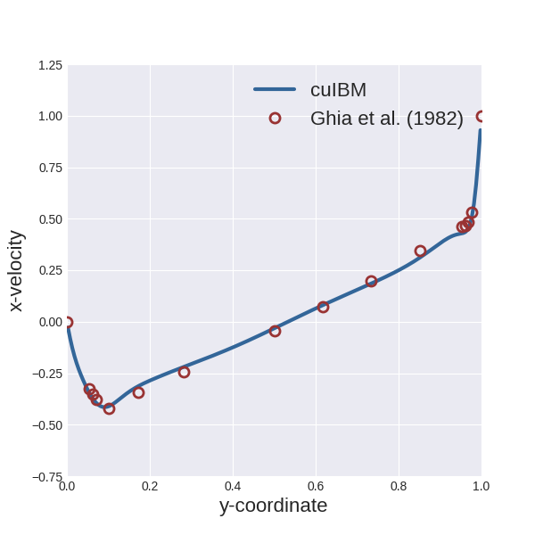

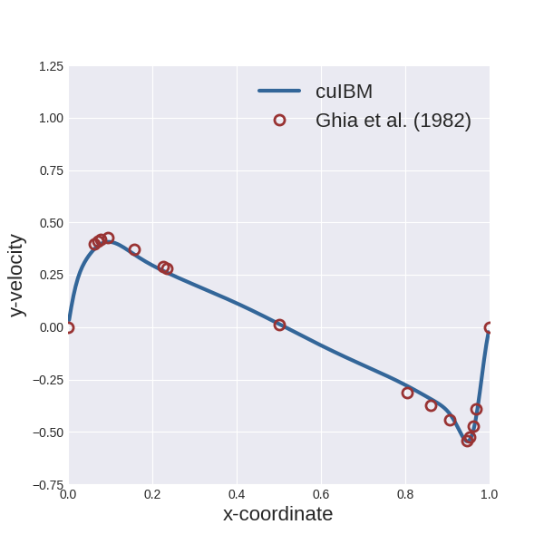

To plot the filled contour of the vorticity field:

    > python scripts/plotVorticity.py

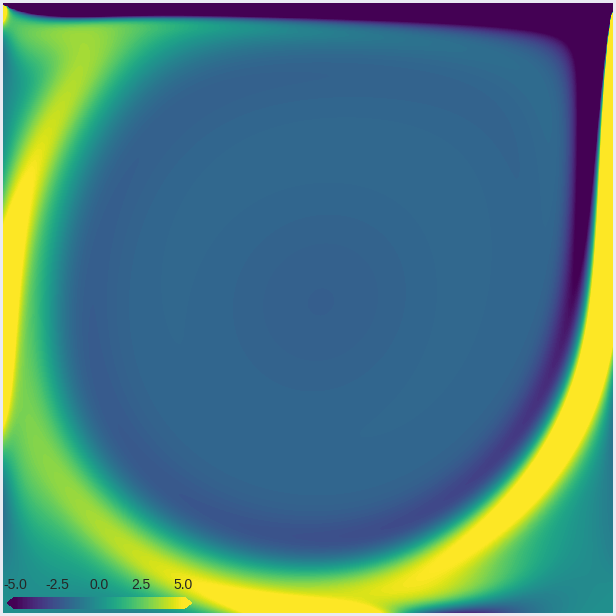

### Re = 5000

Using an NVIDIA K40c device, we computed `60000` time steps (time-step size `0.002`) on a `192x192` grid in about 10 minutes.

To run the example:

    > cd $CUIBM_DIR/examples/lidDrivenCavity/Re5000
    > cuibm

To plot the velocity components at mid-cavity and compare with results from Ghia et al. (1982):

    > python scripts/plotCenterlineVelocities.py

The figures should be saved in the folder `images`; here are the figures we obtained:

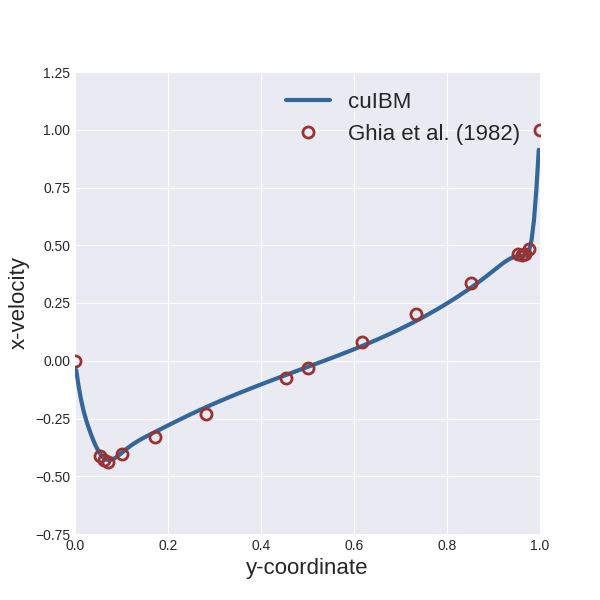

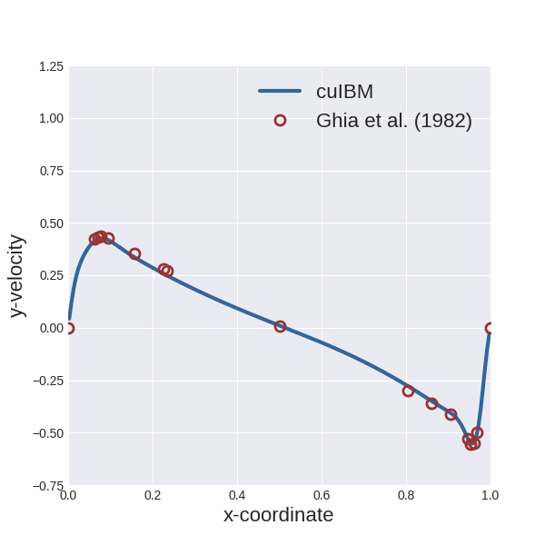

To plot the filled contour of the vorticity field:

    > python scripts/plotVorticity.py

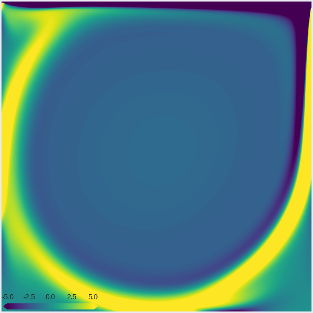

### References

* Ghia, U. K. N. G., Ghia, K. N., & Shin, C. T. (1982). High-Re solutions for incompressible flow using the Navier-Stokes equations and a multigrid method. Journal of computational physics, 48(3), 387-411.